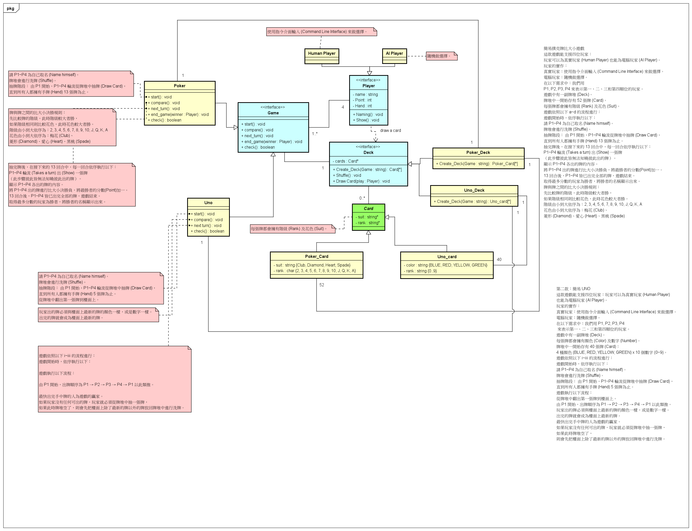

Below is a sample **README** written in Markdown, combining the content and images you provided, along with a brief explanation of the project's purpose, structure, and how to run it on Replit.

---

# Card Games (Poker & UNO) – README

This project was generated with **C++**.  
You can run it online via **[Replit](https://replit.com/@as95630as/TatteredMenacingVolume)**.

## Overview

This repository contains a demonstration of two card games, **Poker** and **UNO**, implemented in C++ using **Object-Oriented Programming** principles. The design follows **Interface** + **Abstract Template Classes** + **Concrete Implementations** to reduce duplicated code and maintain a clean, extensible architecture.  

- **Poker**: 4 players (Human & AI), deals 13 cards each, compares ranks and suits, scores for each round, and announces a final winner.  
- **UNO**: 4 players (Human & AI), each starts with 5 cards, must match the top card's color or number, or draw a card otherwise, and first to empty their hand wins.

## UML Graph

Below are the **OOA (Object-Oriented Analysis)** diagrams and **OOD (Object-Oriented Design)** diagrams, which outline the classes, their relationships, and the overall sequence of operations.

---

### 1. OOA (Object-Oriented Analysis)

<table>
  <tr>
    <td>
      <strong>OOA</strong><br>
      
    </td>
  </tr>
</table>

---

### 2. OOD (Object-Oriented Design)

<table>
  <tr>
    <td>
      <strong>OOD</strong><br>
      
    </td>
  </tr>
</table>

---

### 3. Sequence Graph

<table>
  <tr>
    <td>
      <strong>Sequence Diagram</strong><br>
      
    </td>
  </tr>
</table>

---

## Project Structure

A recommended file/directory structure might look like this (simplified example):

```
CardGames/
 ├─ CMakeLists.txt
 └─ src/
     ├─ interface/
     │    ├─ IGame.h
     │    ├─ IPlayer.h
     │    ├─ IDeck.h
     │    └─ ICard.h
     ├─ abstract/
     │    ├─ AbstractGame.h
     │    ├─ AbstractPlayer.h
     │    ├─ AbstractDeck.h
     │    └─ AbstractCard.h
     ├─ player/
     │    ├─ HumanPlayer.h
     │    ├─ HumanPlayer.cpp
     │    ├─ AIPlayer.h
     │    └─ AIPlayer.cpp
     ├─ poker/
     │    ├─ Poker.h
     │    ├─ Poker.cpp
     │    ├─ PokerDeck.h
     │    ├─ PokerDeck.cpp
     │    ├─ PokerCard.h
     │    └─ PokerCard.cpp
     ├─ uno/
     │    ├─ Uno.h
     │    ├─ Uno.cpp
     │    ├─ UnoDeck.h
     │    ├─ UnoDeck.cpp
     │    ├─ UnoCard.h
     │    └─ UnoCard.cpp
     └─ main.cpp
```

- **interface/**: All pure interfaces (IGame, IPlayer, IDeck, ICard).  
- **abstract/**: Abstract template classes (AbstractGame, AbstractDeck, AbstractPlayer, AbstractCard), implementing shared logic and the Template Method patterns.  
- **player/**: Concrete player implementations (HumanPlayer, AIPlayer).  
- **poker/**, **uno/**: Game-specific implementations (Poker, Uno, PokerDeck, UnoDeck, etc.).  
- **main.cpp**: Program entry point.

---

## How to Run on Replit

1. Open the provided **[Replit link](https://replit.com/@as95630as/TatteredMenacingVolume)**.  
2. Click the **Run** button (or the ▶️ icon).  
3. Follow the terminal prompts to select your game mode (Poker or UNO), and how many AI vs. Human players.  
4. Enjoy the game!

---

## License

(Optionally include your licensing terms, e.g., MIT License, GPLv3, etc.)

---

### Contact

If you have any questions or suggestions, feel free to contact the project maintainer (insert your details).

---

**Enjoy exploring the Card Games project!**
